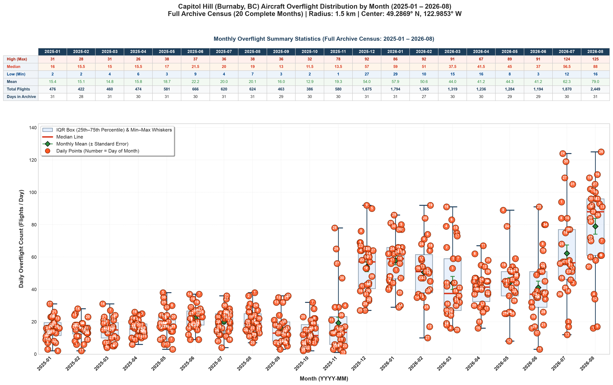
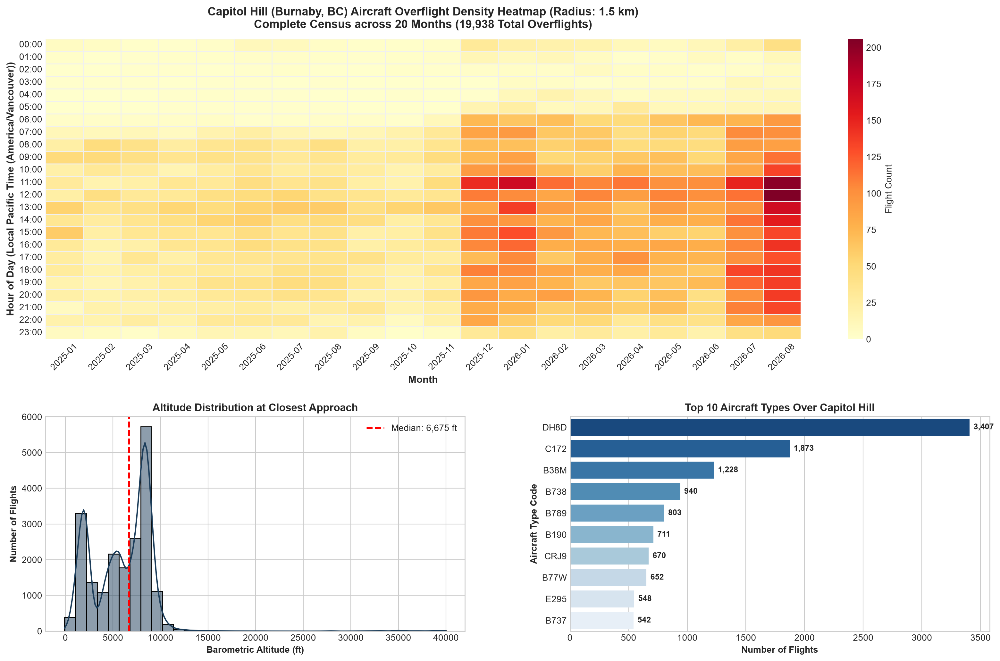

# Aircraft Overflight of Capitol Hill, Burnaby
### An independent measurement study using open ADS-B records, January 2025 – August 2026

**Author:** Damian Yap, PhD  
**Location:** Capitol Hill, Burnaby, British Columbia (49.2869° N, 122.9853° W)  
**Study Period:** 1 January 2025 – 31 August 2026 (608 calendar days; 573 with usable archive coverage)  
**Records Analyzed:** 20,093 aircraft-days across 2,050 unique aircraft  
**Full Report:** [`Capitol_Hill_Overflight_Independent_Study_2025-2026.pdf`](./Capitol_Hill_Overflight_Independent_Study_2025-2026.pdf)

---

## Executive Summary

On **27 November 2025**, aircraft overflights above Capitol Hill in Burnaby, BC underwent an abrupt, permanent step-change:

* **Arriving Commercial Traffic:** Commercial airliner passes within 500 m of the Capitol Hill summit surged from **2.21 per day** to **13.34 per day** (a **6.04× increase**), reaching **22.0 per day** by August 2026.
* **Lower and Closer:** When arriving aircraft pass the summit, their median altitude dropped from **7,675 ft to 5,338 ft** (2,337 ft lower), and their median straight-line distance decreased from **2.26 km to 1.52 km** (0.74 km closer).
* **AIRAC Date Alignment:** The changepoint aligns with ICAO AIRAC cycle 2513 (27 November 2025), the exact date NAV CANADA implemented new arrival procedures under the **Vancouver Airspace Modernization Project (VAMP)**.
* **Airspace Change vs. Data Artifact (Negative Control):** Traffic categories left untouched by VAMP (floatplanes, helicopters, and commercial traffic at or above 10,000 ft) showed **no increase** (rate ratio 0.97× and 0.90×, not significant). This negative control confirms the surge is a genuine routing alteration, not an artifact of receiver network growth.

---

## Headline Measurements

| Measurement | Before (1 Jan – 26 Nov 2025) | After (27 Nov 2025 – 31 Aug 2026) | Change (95% CI) |
| :--- | :---: | :---: | :---: |
| **Arriving commercial aircraft within 500 m** | 2.21 / day | 13.34 / day | **6.04×** (5.24–7.03) |
| **All arriving commercial aircraft within 1.5 km** | 6.17 / day | 43.37 / day | **7.03×** (6.40–7.76) |
| **Business & private jets within 1.5 km** | 1.62 / day | 4.02 / day | **2.47×** (2.17–2.83) |
| **All aircraft within 1.5 km** | 17.48 / day | 56.84 / day | **3.25×** (3.03–3.49) |
| **Control: Light aircraft, floatplanes, helicopters** | 8.53 / day | 8.23 / day | 0.97× (0.85–1.10) *n.s.* |
| **Control: Commercial traffic at 10,000+ ft** | 0.49 / day | 0.44 / day | 0.90× (0.69–1.17) *n.s.* |
| **Typical height of arrival within 500 m** | 7,675 ft | 5,338 ft | **2,337 ft lower** |
| **Typical straight-line distance from summit** | 2.26 km | 1.52 km | **0.74 km closer** |

*Rate ratios are post/pre means of daily counts with 95% bootstrap confidence intervals (4,000 resamples).*

---

## Key Visualizations

### 1. Monthly Overflight Distribution & Daily Ranges


### 2. Flight Density Heatmap (Local Time vs. Day of Week)


---

## Repository Structure

```text
├── README.md                                          # Project documentation
├── LICENSE                                            # MIT (Code) + CC BY 4.0 (Data & Reports)
├── requirements.txt                                   # Python dependencies
├── Capitol_Hill_Overflight_Independent_Study_2025-2026.pdf # Full 12-page study report
│
├── config.py                                          # Coordinate parameters & bounding box limits
├── geo_utils.py                                       # Haversine distance, bounding box & trajectory parsing
├── database.py                                        # SQLite schema, indexing, and upsert routines
├── stream_reader.py                                   # Streaming decompressor for tar/tar.gz archives
├── pipeline.py                                        # Automated ADS-B extraction pipeline (adsb.lol)
│
├── analyze.py                                         # Statistical aggregation, boxplots, and heatmaps
├── generate_report_figures.py                         # 300 DPI publication-ready figures
├── generate_pdf_report.py                             # Automated 4-page summary PDF generator (ReportLab)
│
├── exports/                                           # Auditable CSV exports
│   ├── capitol_hill_all_flights.csv                   # Full record-level dataset (20,093 records)
│   ├── daily_flight_counts_complete_months.csv        # Daily flight tallies
│   └── monthly_flight_summary_complete_months.csv     # Monthly summary statistics
└── report_figures/                                    # Generated publication assets
```

---

## Getting Started & Reproducibility

### Prerequisites
* Python 3.10+
* SQLite 3

### Installation
```bash
git clone https://github.com/oncoapop/capitol_hill_flights.git
cd capitol_hill_flights
python3 -m venv .venv
source .venv/bin/activate
pip install -r requirements.txt
```

### Reproduce the Analysis & Visualizations
To regenerate the statistical aggregations, box plots, and heatmaps from the database:
```bash
python3 analyze.py
```

To regenerate the publication figures:
```bash
python3 generate_report_figures.py
```

To compile the automated summary PDF report:
```bash
python3 generate_pdf_report.py
```

---

## Data Source & Methodology

* **Telemetry Source:** Public crowdsourced Mode S / ADS-B records from the [adsb.lol](https://adsb.lol) open database archives (`globe_history_2025` and `globe_history_2026`).
* **Filtering:** Two-stage spatial filter consisting of a rectangular bounding box pre-filter followed by an exact great-circle Haversine computation against the Capitol Hill summit coordinates (`49.2869° N, 122.9853° W`) with a 1.500 km radius.
* **Open Science & Data Availability:** The complete record-level dataset of 20,093 flights is published directly in `exports/capitol_hill_all_flights.csv` to ensure complete reproducibility.

---

## License & Citation

* **Software / Scripts:** Licensed under the [MIT License](./LICENSE).
* **Data, Reports & Figures:** Licensed under [Creative Commons Attribution 4.0 International (CC BY 4.0)](https://creativecommons.org/licenses/by/4.0/).

### Citation
```bibtex
@techreport{yap2026capitolhill,
  author      = {Yap, Damian},
  title       = {Aircraft Overflight of Capitol Hill, Burnaby: An independent measurement study using open ADS-B records, January 2025 -- August 2026},
  institution = {Independent Study},
  address     = {Burnaby, British Columbia, Canada},
  year        = {2026},
  month       = {September},
  url         = {https://github.com/oncoapop/capitol_hill_flights}
}
```
