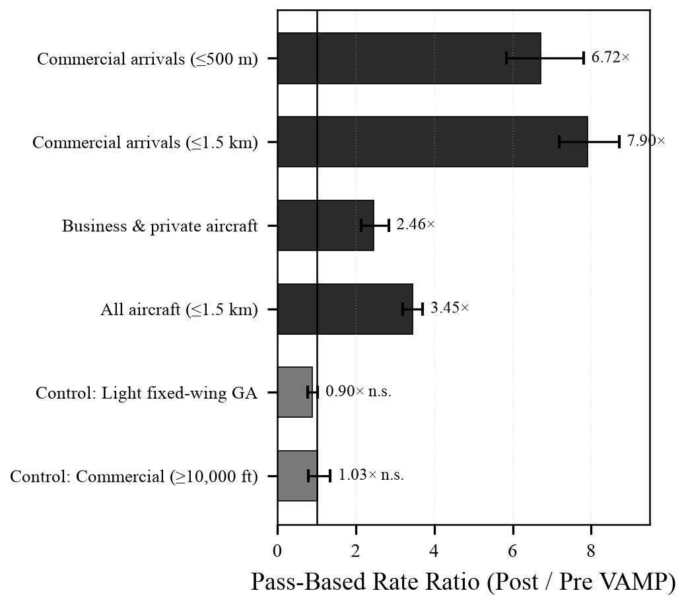
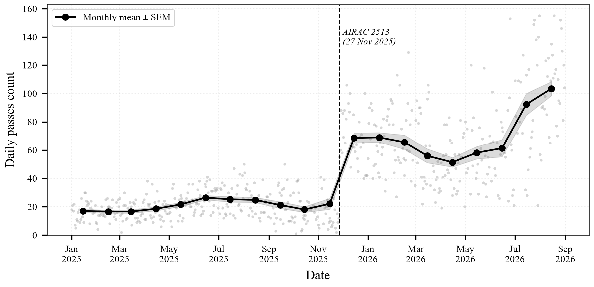
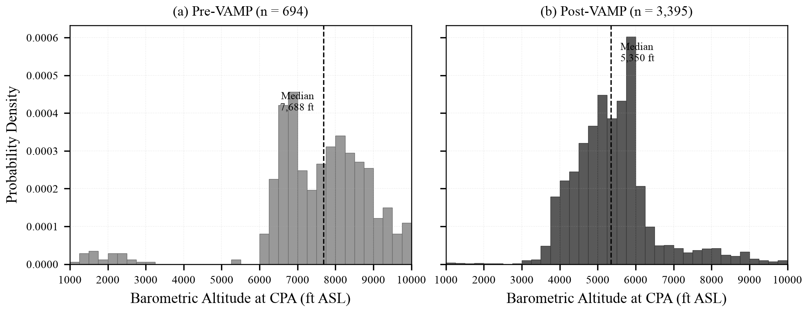
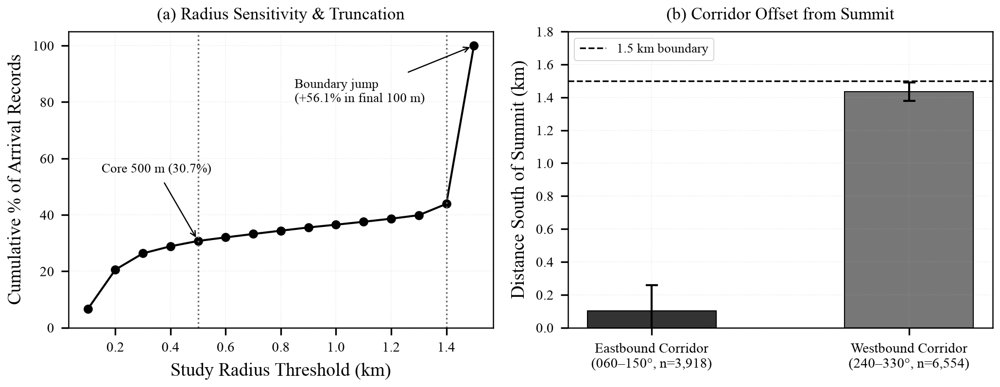

# Aircraft Overflight Census of Capitol Hill, Burnaby (v2.0 Revision)
### An independent empirical study using open crowdsourced ADS-B records, January 2025 – August 2026

**Author:** Damian Yap, PhD  
**Location:** Capitol Hill, Burnaby, British Columbia (49.2869° N, 122.9853° W; summit elevation 115 m ASL; 17.8 km ENE of YVR)  
**Study Period:** 1 January 2025 – 31 August 2026 (608 calendar days; 573 operational days with usable archive coverage)  
**Records Analyzed:** 20,093 aircraft-days (2,050 unique ICAO airframes); 24,190 reconstructed discrete passes  
**Target Journal:** *Journal of Open Aviation Science* (JOAS)  
**Academic Manuscript:** [`Capitol_Hill_Overflight_Manuscript_v2.docx`](./Capitol_Hill_Overflight_Manuscript_v2.docx)  
**Change Log & Audit:** [`CHANGELOG.md`](./CHANGELOG.md) | [`reference_audit.md`](./reference_audit.md) | [`open_questions.md`](./open_questions.md)

---

## Executive Summary

On **27 November 2025** (AIRAC cycle 2513), aircraft overflights above Capitol Hill in Burnaby, BC underwent an abrupt, permanent operational restructuring following NAV CANADA's implementation of the **Vancouver Airspace Modernization Project (VAMP)** for Vancouver International Airport (YVR):

* **Surge in Overhead Arrivals:** Commercial passenger airliner passes within the 500 m summit core increased **6.72-fold** from **2.23 per day** to **15.00 per day** (95% CI: 5.84–7.81; p = 8.14e-55). Across the broader 1.5 km study circle, commercial arrivals rose **7.90-fold** from **6.51 to 51.46 passes per day** (p = 2.76e-93).
* **Lower and Closer:** Arriving commercial aircraft within 500 m of the summit descended **~2,400 ft lower** (median barometric altitude dropping from 7,700 ft to 5,300 ft ASL) and contracted **0.74 km closer** (median 3D slant distance dropping from 2.26 km to 1.52 km).
* **Structural Directional Reversal:** Commercial arrival tracks underwent a complete substitution from predominantly North–South paths (77.6% pre-VAMP) to East–West arrival corridors (93.0% post-VAMP).
* **Negative Controls & Methods Validation:** Flight categories unaffected by VAMP—light fixed-wing aircraft (RR = 0.90×, p = 0.12) and commercial flights ≥10,000 ft (RR = 1.03×, p = 0.71)—showed no significant change. Official Statistics Canada data confirmed that YVR total airport movements were essentially flat (−0.5%), refuting regional traffic growth.

---

## Headline Measurements (Pass-Based Census)

| Operational Category | Pre-VAMP (317 days) | Post-VAMP (256 days) | Rate Ratio (95% CI) | Statistical Significance |
| :--- | :---: | :---: | :---: | :---: |
| **Commercial arrivals within 500 m** | **2.23 / day** | **15.00 / day** | **6.72×** (5.84–7.81) | p = 8.14e-55 |
| **All commercial arrivals within 1.5 km** | **6.51 / day** | **51.46 / day** | **7.90×** (7.18–8.71) | p = 2.76e-93 |
| **Business & private aircraft within 1.5 km** | 1.72 / day | 4.24 / day | **2.46×** (2.14–2.84) | p = 2.73e-32 |
| **All aircraft combined within 1.5 km** | **20.15 / day** | **69.54 / day** | **3.45×** (3.20–3.71) | p = 6.09e-84 |
| **Control: Light fixed-wing GA (excl. heli)** | 8.87 / day | 7.95 / day | 0.90× (0.78–1.03) | p = 0.12 *(not significant)* |
| **Control: Commercial traffic at 10,000+ ft** | 0.49 / day | 0.51 / day | 1.03× (0.79–1.35) | p = 0.71 *(not significant)* |
| **Median altitude of arrivals within 500 m** | 7,700 ft | 5,300 ft | **2,400 ft lower** | IQR: 4,675–5,850 ft |
| **Median 3D slant distance from summit** | 2.26 km | 1.52 km | **0.74 km closer** | IQR: 1.33–1.68 km |

*Denominators are operational days with usable archives (317 pre-VAMP, 256 post-VAMP). Rate ratios are post/pre daily means with 95% percentile bootstrap confidence intervals (4,000 resamples); p-values from two-sided Mann–Whitney U test.*

---

## Publication Figures

### Rate Ratios & Control Comparisons


### 20-Month Daily Overflight Timeseries


### Altitude Distribution Shifts at Closest Approach


### Corridor Geometry & Boundary Truncation


---

## Repository Structure

```text
├── README.md                                          # Project documentation & headline results
├── CHANGELOG.md                                       # Full audit changelog of all corrected values
├── reference_audit.md                                 # Verification audit of all 24 citations
├── open_questions.md                                  # Methodological limitations & open questions
├── LICENSE                                            # MIT (Code) + CC BY 4.0 (Data) + OGL-Canada
├── verify.py                                          # Automated verification test suite
│
├── Capitol_Hill_Overflight_Manuscript_v2.docx         # Revised academic manuscript (JOAS format)
├── generate_figures.py                                # Generates all 300 DPI publication figures
├── generate_manuscript_v2.py                          # Compiles manuscript DOCX with hyperlinked references
│
├── data/                                              # Authoritative read-only research inputs
│   ├── capitol_hill_all_flights.csv                   # Full record-level dataset (20,093 records)
│   ├── capitol_hill_passes.csv                        # Reconstructed discrete passes (24,190 passes)
│   ├── daily_flight_counts_complete_months.csv        # Daily flight counts
│   ├── 23100296.csv                                   # Statistics Canada Table 23-10-0296 (Airports)
│   ├── 23100303.csv                                   # Statistics Canada Table 23-10-0303 (Provinces)
│   └── 23100298.csv                                   # Statistics Canada Table 23-10-0298 (Itinerant GA)
│
├── analysis/                                          # Reproducible modular analysis scripts
│   ├── build_all.py                                   # Master orchestrator compiling results.json
│   ├── results.json                                   # Machine-readable master statistics output
│   ├── aircraft_classification.json                   # Verified operational airframe mapping
│   ├── monthly_summary_recomputed.csv                 # Recomputed 20-month monthly census
│   ├── section2_1_coverage_passes.py                  # Pass clustering & threshold sensitivity
│   ├── section2_2_changepoint.py                      # Least-squares & PELT changepoint detection
│   ├── section2_3_categorisation.py                   # Categorization & vertical rate validation
│   ├── section2_4_rate_ratios.py                      # Bootstrap CIs & Mann-Whitney U tests
│   ├── section2_5_altitude_proximity.py               # Altitude & 3D slant distance geometry
│   ├── section2_6_direction.py                        # Heading band distribution tables
│   ├── section2_7_corridor_truncation.py              # Corridor localization & radius sensitivity
│   ├── section2_8_seasonality.py                      # Season-matched sensitivity analysis
│   ├── section2_9_statcan.py                          # StatCan benchmark ratios
│   └── section4_helicopters.py                        # Helicopter trend & limitation analysis
│
├── figures/                                           # Regenerated publication figures (300 DPI)
└── deprecated/                                        # Quarantined legacy files & documentation
```

---

## Replication & Verification

To verify all numbers in the manuscript against the authoritative record-level data:

```bash
# 1. Activate virtual environment
source .venv/bin/activate

# 2. Run verification test suite
python verify.py

# 3. Regenerate all analysis sections and master results.json
python analysis/build_all.py

# 4. Regenerate publication figures
python generate_figures.py

# 5. Build manuscript DOCX
python generate_manuscript_v2.py
```

---

## Open Science, Licensing, and Attribution

* **Software and Code:** Licensed under the [MIT License](./LICENSE).
* **Data, Reports, and Manuscript Text:** Licensed under the [Creative Commons Attribution 4.0 International License (CC BY 4.0)](https://creativecommons.org/licenses/by/4.0/).
* **Statistics Canada Data:** Contains information licensed under the [Open Government Licence – Canada](https://open.canada.ca/en/open-government-licence-canada).
* **ADS-B Telemetry Archives:** Curated by the open-source community at [adsb.lol](https://globe.adsb.lol).
